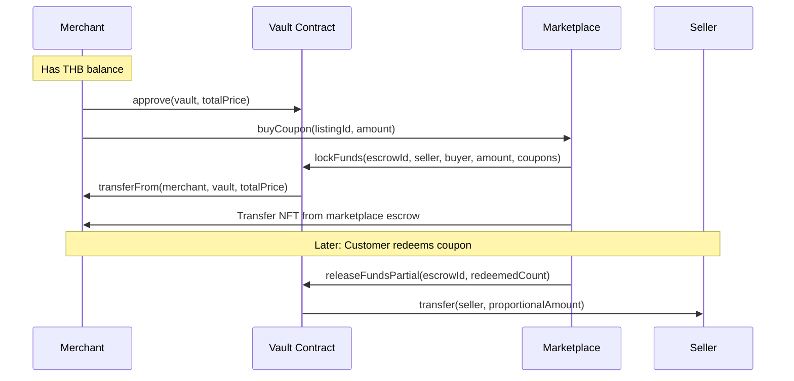
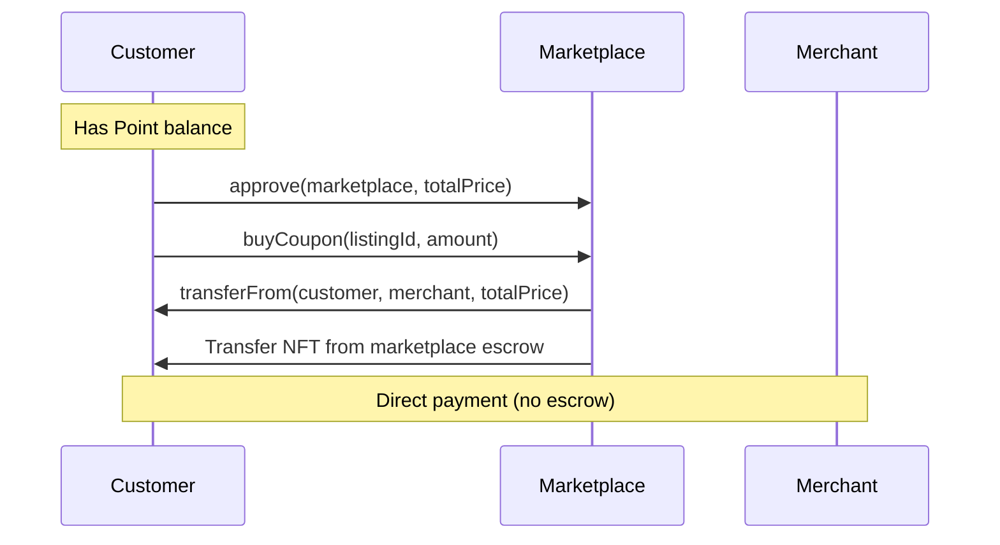

# Complete Voucher Marketplace Guide
## Three-Tier Marketplace: Seller → Merchant → Customer

**Last Updated**: November 29, 2025  
**Version**: 1.0.0

---

## Table of Contents

1. [Overview](#overview)
2. [System Architecture](#system-architecture)
3. [Token Flow](#token-flow)
4. [Complete Journey](#complete-journey)
5. [API Reference](#api-reference)
6. [Blockchain Operations](#blockchain-operations)
7. [Database Schema](#database-schema)
8. [State Transitions](#state-transitions)
9. [Troubleshooting](#troubleshooting)
10. [Testing Guide](#testing-guide)

---

## Overview

### Business Model

The voucher marketplace operates in a three-tier system:

```
Seller (Creates) → Merchant (Distributes) → Customer (Redeems)
         ↓                    ↓                      ↓
     THB Token           Point Token            Redemption
```

### Key Concepts

- **Seller**: Creates vouchers from real-world coupons, mints NFTs, lists on marketplace with THB
- **Merchant**: Buys vouchers from sellers with THB, re-sells to customers with Point tokens
- **Customer**: Buys vouchers from merchants with points, redeems at physical stores
- **NFT Escrow**: Marketplace holds NFTs in escrow during active listings
- **Payment Tokens**: 
  - THB (0xb5575000400c30ef495a32D10db4B22Fc3a7439b) - Seller→Merchant
  - Point (Custom ERC-20) - Merchant→Customer

---

## System Architecture

### Smart Contracts

```
┌─────────────────────────────────────────────────────────────┐
│                    Marketplace Contract                      │
│              0x0cd9dcB19A40e0b853AC9248aA6Df87663dfa2B5      │
│                                                               │
│  • listCoupon(typeId, amount, price, paymentToken)          │
│  • buyCoupon(listingId, amount)                             │
│  • Whitelist management                                      │
│  • NFT Escrow (holds NFTs during listing)                   │
└─────────────────────────────────────────────────────────────┘
         ↓ Uses                 ↓ Uses                ↓ Uses
┌──────────────────┐  ┌──────────────────┐  ┌──────────────────┐
│  Coupon (NFT)    │  │   THB Token      │  │   Point Token    │
│  ERC-1155        │  │   ERC-20         │  │   ERC-20         │
│  0x6eCAF...      │  │   0xb557...      │  │   Custom         │
└──────────────────┘  └──────────────────┘  └──────────────────┘
         ↓
┌─────────────────────────────────────────────────────────────┐
│                      Vault Contract                          │
│              0x1d280e0C7d854fA209Beb9C2653d0eaA57f59Dbb      │
│                                                               │
│  • lockFunds() - Escrow THB payments                         │
│  • releaseFundsPartial() - Release on redemption (FIFO)     │
│  • returnFunds() - Refund if delisted                        │
└─────────────────────────────────────────────────────────────┘
```

### Backend Architecture

```
NestJS Backend
├── Controllers (API Endpoints)
├── Handlers (Business Logic)
│   ├── createVoucherWithCodes.handler.ts
│   ├── sellerListOnMarketplace.handler.ts
│   ├── merchantBuyCouponFromSeller.handler.ts
│   ├── activateVoucher.handler.ts
│   └── buyCouponFromMarketplace.handler.ts
├── Services
│   ├── blockchain.service.ts (Web3 interactions)
│   ├── voucher-db.service.ts (Database operations)
│   └── token.service.ts (Encryption/Decryption)
└── Database (PostgreSQL + Prisma)
    ├── Voucher
    ├── VoucherCode
    ├── Transaction
    └── Wallet
```

---

## Token Flow

### THB Token Flow (Seller → Merchant)



**Key Points:**
- Merchant approves **Vault** for THB spending
- Vault locks THB in escrow (not immediate payment)
- Seller receives payment when customers redeem (FIFO)
- Proportional release: `amountPerCoupon = totalEscrowed / totalCoupons`

### Point Token Flow (Merchant → Customer)



**Key Points:**
- Customer approves **Marketplace** for Point spending (NOT Vault!)
- Direct payment to merchant (no escrow)
- Instant settlement

### Approval Pattern Summary

| Buyer    | Payment Token | Approve Target | Reason                    |
|----------|--------------|----------------|---------------------------|
| Merchant | THB          | Vault          | Escrow for seller payment |
| Customer | Point        | Marketplace    | Direct payment to merchant|

---

## Complete Journey

### Phase 0: Seller Creates Voucher Inventory

**API Endpoint**: `POST /coupon/dev/interim-seller`

**Purpose**: Create voucher in database (no blockchain yet)

**Request**:
```bash
curl -X POST http://localhost:4000/coupon/dev/interim-seller \
  -H "Content-Type: application/json" \
  -d '{
    "sellerWalletAddress": "0x742d35Cc6634C0532925a3b844Bc9e7595f0bEb",
    "coupon": {
      "name": "Starbucks 100 THB",
      "description": "100 THB discount at any Starbucks branch",
      "valueType": "cash",
      "value": 100,
      "startDate": "2025-12-01T00:00:00Z",
      "endDate": "2026-06-01T00:00:00Z",
      "totalIssued": 1000,
      "merchantRef": "STAR-2025-001"
    }
  }'
```

**Response** (200 OK):
```json
{
  "success": true,
  "message": "Voucher created successfully",
  "data": {
    "voucherId": "cm4abc123def456ghi789",
    "tokenId": "15",
    "totalIssued": 1000,
    "status": "upcoming",
    "merchantId": null
  }
}
```

**Database Changes**:
```sql
-- Voucher record
INSERT INTO Voucher (
  id, name, tokenId, totalIssued, status, merchantId
) VALUES (
  'cm4abc123def456ghi789', 'Starbucks 100 THB', '15', 1000, 'upcoming', NULL
);

-- No VoucherCodes created yet
-- Codes will be created when merchant activates
```

**Blockchain Operations**:
1. `couponContract.createCouponType(name, startDate, endDate)` → typeId (tokenId)
2. No minting yet (seller will mint when listing)

**Error Responses**:

```json
// 400 - Invalid wallet address
{
  "statusCode": 400,
  "message": "Invalid seller wallet address format",
  "error": "Bad Request"
}

// 400 - Invalid dates
{
  "statusCode": 400,
  "message": "endDate must be greater than startDate",
  "error": "Bad Request"
}

// 500 - Blockchain error
{
  "statusCode": 500,
  "message": "Failed to create coupon type on blockchain: execution reverted",
  "error": "Internal Server Error"
}
```

---

### Phase 1: Seller Lists on Marketplace (THB)

**API Endpoint**: `POST /coupon/seller/list-on-marketplace`

**Purpose**: Mint NFTs and list on marketplace with THB as payment

**Request**:
```bash
curl -X POST http://localhost:4000/coupon/seller/list-on-marketplace \
  -H "Content-Type: application/json" \
  -d '{
    "voucherId": "cm4abc123def456ghi789",
    "amount": 500,
    "pricePerUnitTHB": 80,
    "sellerWalletAddress": "0x742d35Cc6634C0532925a3b844Bc9e7595f0bEb"
  }'
```

**Response** (200 OK):
```json
{
  "success": true,
  "message": "Voucher listed on marketplace successfully",
  "data": {
    "listingId": "18",
    "voucherId": "cm4abc123def456ghi789",
    "tokenId": "15",
    "amount": 500,
    "pricePerUnit": "80.0",
    "paymentToken": "0xb5575000400c30ef495a32D10db4B22Fc3a7439b",
    "seller": "0x742d35Cc6634C0532925a3b844Bc9e7595f0bEb",
    "txHash": "0x1234abcd...",
    "blockNumber": 1830000
  }
}
```

**Blockchain Operations**:

```javascript
// Step 1: Check whitelist
const isWhitelisted = await marketplace.whitelist(sellerAddress);
if (!isWhitelisted) {
  await marketplace.addToWhitelist(sellerAddress);
}

// Step 2: Mint NFTs to seller
await couponContract.mint(
  sellerAddress,  // to
  tokenId,        // typeId: "15"
  amount          // 500
);
// Seller now has 500 NFTs (typeId=15)

// Step 3: Approve marketplace (if not already approved)
const isApproved = await couponContract.isApprovedForAll(
  sellerAddress,
  marketplaceAddress
);
if (!isApproved) {
  await couponContract.setApprovalForAll(marketplaceAddress, true);
}

// Step 4: List on marketplace
const tx = await marketplace.listCoupon(
  tokenId,              // 15
  amount,               // 500
  pricePerUnitWei,      // 80 * 10^18
  thbAddress            // 0xb557...
);

// Event: CouponListed(listingId=18, typeId=15, seller, amount=500, price=80)
// NFTs transferred: seller → marketplace escrow
```

**NFT Movement**:
```
Before: Seller owns 500 NFTs (typeId=15)
After:  Marketplace escrow holds 500 NFTs
        Seller balance = 0 (escrowed)
```

**Marketplace State**:
```solidity
listings[18] = {
  seller: 0x742d35Cc6634C0532925a3b844Bc9e7595f0bEb,
  typeId: 15,
  amount: 500,
  pricePerUnit: 80000000000000000000,  // 80 THB in wei
  paymentToken: 0xb5575000400c30ef495a32D10db4B22Fc3a7439b,  // THB
  active: true,
  listedAt: 1732876800
}
```

**Error Responses**:

```json
// 400 - Voucher already sold to merchant
{
  "statusCode": 400,
  "message": "This voucher is already assigned to a merchant. Only unassigned vouchers can be listed by sellers.",
  "error": "Bad Request"
}

// 400 - Insufficient vouchers
{
  "statusCode": 400,
  "message": "Cannot list 500 vouchers. Only 300 available.",
  "error": "Bad Request"
}

// 400 - Not whitelisted (auto-fixed by backend)
{
  "statusCode": 400,
  "message": "Seller not whitelisted on marketplace",
  "error": "Bad Request"
}

// 500 - Blockchain mint error
{
  "statusCode": 500,
  "message": "Failed to mint coupons on blockchain: insufficient gas",
  "error": "Internal Server Error"
}
```

---

### Phase 2: Merchant Buys from Seller (THB)

**API Endpoint**: `POST /coupon/merchant/buy-from-seller`

**Purpose**: Merchant purchases vouchers using THB token

**Request**:
```bash
curl -X POST http://localhost:4000/coupon/merchant/buy-from-seller \
  -H "Content-Type: application/json" \
  -d '{
    "listingId": "18",
    "amount": 100,
    "merchantId": "cm3merchant123xyz"
  }'
```

**Response** (200 OK):
```json
{
  "success": true,
  "message": "Successfully purchased 100 coupons from seller",
  "data": {
    "voucherId": "cm4abc123def456ghi789",
    "listingId": "18",
    "amount": 100,
    "totalPrice": "8000.0",
    "paymentToken": "THB",
    "merchantId": "cm3merchant123xyz",
    "txHash": "0x5678efgh...",
    "blockNumber": 1830150,
    "transaction": {
      "id": "cm4tx789abc",
      "type": "MERCHANT_PURCHASE_FROM_SELLER",
      "pointId": null,
      "amount": 100,
      "createdAt": "2025-11-29T10:30:00Z"
    }
  }
}
```

**Blockchain Operations**:

```javascript
// Step 1: Get merchant wallet
const merchant = await prisma.merchant.findUnique({
  where: { id: merchantId },
  include: { wallet: true }
});
const merchantAddress = merchant.wallet.walletAddress;
const merchantPrivateKey = decrypt(merchant.wallet.privateKey);

// Step 2: Get marketplace listing
const listing = await marketplace.getListing(listingId);
// Verify: listing.paymentToken === thbAddress
// Verify: listing.active === true
// Verify: listing.amount >= amount

// Step 3: Check merchant THB balance
const thbBalance = await thbToken.balanceOf(merchantAddress);
const totalPrice = listing.pricePerUnit * amount; // 80 * 100 = 8000 THB

// Step 4: Auto-mint THB if insufficient (PHASE 1)
if (thbBalance < totalPrice) {
  const shortage = totalPrice - thbBalance;
  console.log(`Auto-minting ${shortage} THB to merchant`);
  await thbToken.mint(merchantAddress, shortage);
}

// Step 5: Approve vault for THB spending
await thbToken.approve(vaultAddress, totalPrice);

// Step 6: Buy from marketplace
const tx = await marketplace.buyCoupon(listingId, amount);

// Marketplace calls vault.lockFunds():
// - Generate escrowId
// - Transfer THB: merchant → vault (8000 THB)
// - Transfer NFT: marketplace escrow → merchant (100 NFTs)
// - Store escrow data for future release

// Event: CouponSold(listingId=18, typeId=15, seller, buyer=merchant, amount=100, price=8000)
```

**Token/NFT Movement**:
```
THB Token:
  Merchant: 10000 → 2000 (spent 8000, auto-mint if needed)
  Vault:    0 → 8000 (escrowed for seller)
  
NFT (typeId=15):
  Marketplace escrow: 500 → 400 (transferred 100)
  Merchant: 0 → 100 (received)
  
Listing:
  listing[18].amount: 500 → 400 (still active)
```

**Database Changes**:
```sql
-- Update voucher ownership
UPDATE Voucher 
SET merchantId = 'cm3merchant123xyz',
    status = 'upcoming'  -- Waiting for activation
WHERE id = 'cm4abc123def456ghi789';

-- Create transaction record
INSERT INTO Transaction (
  type, merchantId, amount, tokenAddress
) VALUES (
  'MERCHANT_PURCHASE_FROM_SELLER',
  'cm3merchant123xyz',
  100,
  NULL  -- THB not tracked in DB
);

-- VoucherCodes not created yet (wait for activation)
```

**Vault Escrow State**:
```solidity
escrows[escrowId] = {
  seller: 0x742d35Cc6634C0532925a3b844Bc9e7595f0bEb,
  buyer: 0xd736AA88a61FEc2D7A6648968EEBA349232e351D,  // merchant
  totalAmount: 8000000000000000000000,  // 8000 THB
  remainingAmount: 8000000000000000000000,
  couponsLocked: 100,
  couponsRedeemed: 0,
  active: true,
  lockedAt: 1732876950
}
```

**Error Responses**:

```json
// 400 - Wrong payment token
{
  "statusCode": 400,
  "message": "Listing does not use THB token. Expected THB, got 0x3a1E...",
  "error": "Bad Request"
}

// 400 - Insufficient listing amount
{
  "statusCode": 400,
  "message": "Listing only has 50 coupons available, requested 100",
  "error": "Bad Request"
}

// 400 - Merchant wallet not found
{
  "statusCode": 400,
  "message": "Merchant wallet not configured",
  "error": "Bad Request"
}

// 500 - Auto-mint failed
{
  "statusCode": 500,
  "message": "Failed to auto-mint THB: execution reverted",
  "error": "Internal Server Error"
}

// 500 - Purchase transaction failed
{
  "statusCode": 500,
  "message": "Failed to buy coupon: transaction execution reverted",
  "error": "Internal Server Error"
}
```

---

### Phase 3: Merchant Activates for Customers (Point)

**API Endpoint**: `PATCH /coupon/activate/:voucherId`

**Purpose**: Merchant lists vouchers for customers using Point tokens

**Request**:
```bash
curl -X PATCH http://localhost:4000/coupon/activate/cm4abc123def456ghi789 \
  -H "Content-Type: application/json" \
  -d '{
    "amount": 20,
    "pointsCost": 50,
    "pointId": "cmij4ghpo00080ocvz8iaytcd",
    "currency": "POINT"
  }'
```

**Response** (200 OK):
```json
{
  "success": true,
  "message": "Voucher activated successfully. 20 codes listed on marketplace.",
  "data": {
    "voucherId": "cm4abc123def456ghi789",
    "listingId": "24",
    "codesCreated": 20,
    "codes": [
      "cm4abc123def456ghi789-0001",
      "cm4abc123def456ghi789-0002",
      "...",
      "cm4abc123def456ghi789-0020"
    ],
    "pointsCost": 50,
    "pointId": "cmij4ghpo00080ocvz8iaytcd",
    "paymentToken": "0x3a1E06881AD8025F79ED7a2Bf92489aBb7329d98",
    "txHash": "0x9abc1234...",
    "blockNumber": 1830300,
    "voucher": {
      "totalIssued": 80,
      "upcomingCodesCount": 80,
      "activeCodesCount": 20,
      "redeemedCodesCount": 0
    }
  }
}
```

**Blockchain Operations**:

```javascript
// Step 1: Validate voucher (status='upcoming', merchantId set)
const voucher = await prisma.voucher.findUnique({
  where: { id: voucherId }
});

// Step 2: Check merchant NFT balance (NO MINTING!)
const merchantAddress = merchant.wallet.walletAddress;
const nftBalance = await couponContract.balanceOf(
  merchantAddress,
  voucher.tokenId  // 15
);

if (nftBalance < amount) {
  throw Error(`Insufficient NFT balance. Required: ${amount}, Available: ${nftBalance}`);
}
// Merchant has 100 NFTs from purchase ✓

// Step 3: Check/add merchant to whitelist
const isWhitelisted = await marketplace.whitelist(merchantAddress);
if (!isWhitelisted) {
  await marketplace.addToWhitelist(merchantAddress);
}

// Step 4: Approve marketplace (if not already)
const isApproved = await couponContract.isApprovedForAll(
  merchantAddress,
  marketplaceAddress
);
if (!isApproved) {
  await couponContract.setApprovalForAll(marketplaceAddress, true);
}

// Step 5: List on marketplace with Point token
const decryptedPrivateKey = decrypt(merchant.wallet.privateKey);
const pointTokenAddress = convertBufferToAddress(point.contractAddress);

const tx = await marketplace.listCoupon(
  voucher.tokenId,      // 15
  amount,               // 20
  pointsCostWei,        // 50 * 10^18
  pointTokenAddress     // 0x3a1E...
);

// Event: CouponListed(listingId=24, typeId=15, seller=merchant, amount=20, price=50)
// NFTs transferred: merchant → marketplace escrow
```

**NFT Movement**:
```
Before: Merchant owns 100 NFTs (typeId=15)
After:  Marketplace escrow holds 20 NFTs
        Merchant balance = 80 NFTs remaining
```

**Database Changes**:
```sql
-- Generate sequential codes
-- Starting from existingCodesCount + 1
INSERT INTO VoucherCode (code, voucherId, pointsCost, pointId, currency, voucherGroupId, isUsed)
VALUES
  ('cm4abc123def456ghi789-0001', 'cm4abc...', 50, 'cmij4...', 'POINT', '24', false),
  ('cm4abc123def456ghi789-0002', 'cm4abc...', 50, 'cmij4...', 'POINT', '24', false),
  ...
  ('cm4abc123def456ghi789-0020', 'cm4abc...', 50, 'cmij4...', 'POINT', '24', false);

-- Update voucher
UPDATE Voucher
SET totalIssued = 80,  -- 100 - 20
    status = 'upcoming'  -- Still has more to activate
WHERE id = 'cm4abc123def456ghi789';

-- If totalIssued becomes 0, status → 'active'
```

**Marketplace State**:
```solidity
listings[24] = {
  seller: 0xd736AA88a61FEc2D7A6648968EEBA349232e351D,  // merchant
  typeId: 15,
  amount: 20,
  pricePerUnit: 50000000000000000000,  // 50 POINT in wei
  paymentToken: 0x3a1E06881AD8025F79ED7a2Bf92489aBb7329d98,  // Point token
  active: true,
  listedAt: 1732877100
}
```

**Error Responses**:

```json
// 400 - Voucher not found or wrong merchant
{
  "statusCode": 400,
  "message": "Voucher not found or does not belong to this merchant",
  "error": "Bad Request"
}

// 400 - Insufficient NFT balance
{
  "statusCode": 400,
  "message": "Merchant has insufficient NFT balance. Required: 20, Available: 10",
  "error": "Bad Request"
}

// 400 - Point doesn't belong to merchant
{
  "statusCode": 400,
  "message": "Point does not belong to this voucher's merchant",
  "error": "Bad Request"
}

// 400 - Point expired
{
  "statusCode": 400,
  "message": "Point token has expired",
  "error": "Bad Request"
}

// 500 - Listing failed
{
  "statusCode": 500,
  "message": "Failed to list coupon: execution reverted",
  "error": "Internal Server Error"
}
```

---

### Phase 4: Customer Buys from Merchant (Point)

**API Endpoint**: `POST /coupon/marketplace/buy`

**Purpose**: Customer purchases voucher using Point tokens

**Request**:
```bash
curl -X POST http://localhost:4000/coupon/marketplace/buy \
  -H "Content-Type: application/json" \
  -d '{
    "voucherGroupId": "24",
    "pointId": "cmij4ghpo00080ocvz8iaytcd",
    "phone": "0984360421"
  }'
```

**Response** (200 OK):
```json
{
  "success": true,
  "message": "Voucher purchased successfully!",
  "data": {
    "voucherCode": {
      "id": "cm4code123",
      "code": "cm4abc123def456ghi789-0001",
      "voucherId": "cm4abc123def456ghi789",
      "pointsCost": 50,
      "currency": "POINT",
      "isUsed": false,
      "currentOwnerId": "cm3cust456",
      "voucherGroupId": "24"
    },
    "voucher": {
      "id": "cm4abc123def456ghi789",
      "name": "Starbucks 100 THB",
      "description": "100 THB discount at any Starbucks branch",
      "value": 100,
      "valueType": "cash"
    },
    "transaction": {
      "id": "cm4tx999",
      "type": "MARKETPLACE_PURCHASE",
      "amount": 50,
      "txHash": "0xdef5678...",
      "blockNumber": 1830500
    },
    "customer": {
      "id": "cm3cust456",
      "phone": "0984360421",
      "remainingBalance": 450
    }
  }
}
```

**Blockchain Operations**:

```javascript
// Step 1: Find customer by phone
const customer = await prisma.customer.findFirst({
  where: { tel: phone },
  include: { wallet: true }
});
const customerAddress = customer.wallet.walletAddress;

// Step 2: Find available VoucherCode
const voucherCode = await prisma.voucherCode.findFirst({
  where: {
    voucherGroupId: voucherGroupId,  // "24"
    pointId: pointId,
    isUsed: false
  },
  include: { voucher: true, point: true }
});

// Step 3: Validate voucher not expired
if (voucher.endDate < now) {
  throw Error('Voucher has expired');
}

// Step 4: Get customer point balance
const pointBalance = await prisma.customer.findUnique({
  where: { id: customerId },
  select: { 
    customerPoints: {
      where: { pointId: pointId }
    }
  }
});

if (pointBalance < voucherCode.pointsCost) {
  throw Error(`Insufficient balance. Required: ${pointsCost}, Available: ${pointBalance}`);
}

// Step 5: Decrypt customer private key
const salt = process.env.SALT;
const decryptedKey = decrypt(salt, customer.wallet.privateKey);

// Step 6: Check/add customer to whitelist
const isWhitelisted = await marketplace.whitelist(customerAddress);
if (!isWhitelisted) {
  await marketplace.addToWhitelist(customerAddress);
}

// Step 7: Get listing and verify seller
const listing = await marketplace.getListing(voucherGroupId);
// Verify: listing.seller === merchant.wallet.walletAddress

// Step 8: Check point token balance on-chain
const pointContract = new Contract(pointTokenAddress, ERC20_ABI, provider);
const onChainBalance = await pointContract.balanceOf(customerAddress);
const totalPrice = listing.pricePerUnit * 1;  // 50 POINT

if (onChainBalance < totalPrice) {
  throw Error('Insufficient on-chain point balance');
}

// Step 9: Approve MARKETPLACE (not vault!) for Point spending
await pointContract.approve(marketplaceAddress, totalPrice);

// Step 10: Buy from marketplace
const tx = await marketplace.buyCoupon(
  voucherGroupId,  // 24
  1                // amount
);

// Marketplace executes:
// - Transfer Point: customer → merchant (direct, no escrow)
// - Transfer NFT: marketplace escrow → customer
// Event: CouponSold(listingId=24, typeId=15, seller=merchant, buyer=customer, amount=1, price=50)
```

**Token/NFT Movement**:
```
Point Token:
  Customer: 500 → 450 (spent 50)
  Merchant: 0 → 50 (received immediately, no escrow)
  
NFT (typeId=15):
  Marketplace escrow: 20 → 19
  Customer: 0 → 1
  
Listing:
  listing[24].amount: 20 → 19 (still active if > 0)
```

**Database Changes**:
```sql
-- Update VoucherCode ownership
UPDATE VoucherCode
SET currentOwnerId = 'cm3cust456',
    isUsed = false  -- Not yet redeemed
WHERE id = 'cm4code123';

-- Deduct customer point balance
UPDATE CustomerPoint
SET balance = balance - 50
WHERE customerId = 'cm3cust456' 
  AND pointId = 'cmij4ghpo00080ocvz8iaytcd';

-- Create transaction record
INSERT INTO Transaction (
  type, customerId, pointId, amount, txHash, blockNumber
) VALUES (
  'MARKETPLACE_PURCHASE',
  'cm3cust456',
  'cmij4ghpo00080ocvz8iaytcd',
  50,
  '0xdef5678...',
  1830500
);
```

**Error Responses**:

```json
// 404 - Customer not found
{
  "statusCode": 404,
  "message": "Customer with phone 0984360421 not found",
  "error": "Not Found"
}

// 400 - No available codes
{
  "statusCode": 400,
  "message": "No available voucher codes for this listing and point",
  "error": "Bad Request"
}

// 400 - Voucher expired
{
  "statusCode": 400,
  "message": "Voucher has expired on 2025-06-01",
  "error": "Bad Request"
}

// 400 - Insufficient balance (DB)
{
  "statusCode": 400,
  "message": "Insufficient point balance. Required: 50, Available: 30",
  "error": "Bad Request"
}

// 400 - Insufficient balance (blockchain)
{
  "statusCode": 400,
  "message": "Insufficient payment token balance. Required: 50.0, Available: 45.0",
  "error": "Bad Request"
}

// 400 - Listing seller mismatch
{
  "statusCode": 400,
  "message": "This listing belongs to a different seller. The merchant may need to re-activate this voucher.",
  "error": "Bad Request"
}

// 500 - Blockchain transaction failed
{
  "statusCode": 500,
  "message": "Failed to buy coupon: transaction execution reverted",
  "error": "Internal Server Error"
}
```

---

### Phase 5: Customer Redeems Voucher

**API Endpoint**: `POST /coupon/redeem`

**Purpose**: Customer redeems voucher at physical store, triggers seller payment

**Request**:
```bash
curl -X POST http://localhost:4000/coupon/redeem \
  -H "Content-Type: application/json" \
  -d '{
    "code": "cm4abc123def456ghi789-0001",
    "merchantId": "cm3merchant123xyz"
  }'
```

**Response** (200 OK):
```json
{
  "success": true,
  "message": "Voucher redeemed successfully",
  "data": {
    "voucherCode": {
      "id": "cm4code123",
      "code": "cm4abc123def456ghi789-0001",
      "isUsed": true,
      "redeemedAt": "2025-12-15T14:30:00Z"
    },
    "voucher": {
      "name": "Starbucks 100 THB",
      "value": 100,
      "valueType": "cash"
    },
    "customer": {
      "phone": "0984360421"
    },
    "txHash": "0xabc9876...",
    "blockNumber": 1831000
  }
}
```

**Blockchain Operations**:

```javascript
// Step 1: Validate code exists and belongs to customer
const voucherCode = await prisma.voucherCode.findUnique({
  where: { code: code },
  include: { voucher: true, currentOwner: true }
});

if (voucherCode.isUsed) {
  throw Error('Voucher code already redeemed');
}

// Step 2: Verify merchant matches voucher
if (voucherCode.voucher.merchantId !== merchantId) {
  throw Error('Voucher does not belong to this merchant');
}

// Step 3: Burn NFT on blockchain
const customerAddress = voucherCode.currentOwner.wallet.walletAddress;
const customerPrivateKey = decrypt(voucherCode.currentOwner.wallet.privateKey);

await couponContract.redeem(
  voucherCode.voucher.tokenId,  // typeId: 15
  1                              // amount
);

// Step 4: Marketplace callback triggers vault release
// marketplace.onCouponRedeemed(typeId=15, amount=1)
// → vault.releaseFundsPartial(escrowId, 1)
// → Transfer THB from vault to seller (proportional amount)
```

**Vault Fund Release (FIFO)**:
```javascript
// Vault finds oldest escrow for typeId=15
escrows[escrowId] = {
  seller: 0x742d...,
  couponsLocked: 100,
  couponsRedeemed: 0 → 1,
  totalAmount: 8000 THB,
  remainingAmount: 8000 → 7920  // Released 80 THB to seller
}

// Calculate proportional release:
amountToRelease = (totalAmount * couponsRedeemed) / couponsLocked
                = (8000 * 1) / 100
                = 80 THB

// Transfer: vault → seller (80 THB)
```

**Token Movement**:
```
THB Token:
  Vault:  8000 → 7920 THB
  Seller: 0 → 80 THB (first redemption payment)
  
NFT (typeId=15):
  Customer: 1 → 0 (burned)
  Total supply decreases
```

**Database Changes**:
```sql
-- Mark code as used
UPDATE VoucherCode
SET isUsed = true,
    redeemedAt = NOW()
WHERE id = 'cm4code123';

-- Create transaction record
INSERT INTO Transaction (
  type, customerId, merchantId, voucherId
) VALUES (
  'VOUCHER_REDEMPTION',
  'cm3cust456',
  'cm3merchant123xyz',
  'cm4abc123def456ghi789'
);
```

**Error Responses**:

```json
// 404 - Code not found
{
  "statusCode": 404,
  "message": "Voucher code not found",
  "error": "Not Found"
}

// 400 - Already redeemed
{
  "statusCode": 400,
  "message": "Voucher code already redeemed",
  "error": "Bad Request"
}

// 400 - Wrong merchant
{
  "statusCode": 400,
  "message": "Voucher does not belong to this merchant",
  "error": "Bad Request"
}

// 400 - No owner
{
  "statusCode": 400,
  "message": "Voucher code has no current owner",
  "error": "Bad Request"
}

// 500 - Blockchain redeem failed
{
  "statusCode": 500,
  "message": "Failed to redeem coupon on blockchain: execution reverted",
  "error": "Internal Server Error"
}
```

---

## API Reference

### Query Endpoints

#### Get Seller Vouchers
```bash
GET /coupon/seller/vouchers?walletAddress={sellerAddress}
```

**Response**:
```json
{
  "success": true,
  "data": {
    "vouchers": [
      {
        "id": "cm4abc...",
        "name": "Starbucks 100 THB",
        "tokenId": "15",
        "totalCodes": 1000,
        "listedCodes": 500,
        "soldCodes": 100,
        "availableForSale": 400,
        "status": {
          "isListed": true,
          "hasSales": true,
          "fullyCreated": true
        }
      }
    ]
  }
}
```

#### Get Merchant Vouchers
```bash
GET /coupon/merchant/{merchantId}
```

**Response**:
```json
{
  "success": true,
  "data": [
    {
      "id": "cm4abc...",
      "name": "Starbucks 100 THB",
      "totalIssued": 80,
      "upcomingCodesCount": 60,
      "activeCodesCount": 19,
      "redeemedCodesCount": 1,
      "status": "upcoming"
    }
  ]
}
```

#### Get Marketplace Listings
```bash
GET /coupon/marketplace/listings
```

**Response**:
```json
{
  "success": true,
  "data": {
    "activeListings": [
      {
        "listingId": "24",
        "seller": "0xd736...",
        "typeId": "15",
        "amount": 19,
        "pricePerUnit": "50.0",
        "paymentToken": "0x3a1E...",
        "paymentTokenSymbol": "POINT",
        "active": true,
        "listedAt": 1732877100
      }
    ]
  }
}
```

#### Get Customer Vouchers
```bash
GET /coupon/my-coupons/{phone}?status=unused&page=1&limit=20
```

**Response**:
```json
{
  "success": true,
  "data": {
    "vouchers": [
      {
        "code": "cm4abc123def456ghi789-0001",
        "voucherName": "Starbucks 100 THB",
        "value": 100,
        "valueType": "cash",
        "isUsed": false,
        "purchasedAt": "2025-12-10T10:00:00Z",
        "expiryDate": "2026-06-01T00:00:00Z"
      }
    ],
    "pagination": {
      "page": 1,
      "limit": 20,
      "total": 3,
      "totalPages": 1
    }
  }
}
```

---

## Blockchain Operations

### Smart Contract Functions

#### Marketplace.listCoupon()

```solidity
function listCoupon(
    uint256 typeId,
    uint256 amount,
    uint256 pricePerUnit,
    address paymentToken
) external returns (uint256 listingId)
```

**Validation**:
- Caller must be whitelisted
- Must have sufficient NFT balance
- NFT must be approved for marketplace
- Price > 0, amount > 0

**Effects**:
- Transfers NFT from seller to marketplace (escrow)
- Creates listing with unique ID
- Emits `CouponListed` event

**Gas**: ~150,000

#### Marketplace.buyCoupon()

```solidity
function buyCoupon(
    uint256 listingId,
    uint256 amount
) external
```

**Validation**:
- Buyer must be whitelisted
- Listing must be active
- Buyer ≠ seller
- Sufficient listing amount
- Buyer has sufficient payment token balance
- Correct allowance set:
  - THB → vault allowance
  - Point → marketplace allowance

**Effects**:
- **THB payment**: Locks funds in vault via `vault.lockFunds()`
- **Point payment**: Direct transfer to seller
- Transfers NFT from marketplace escrow to buyer
- Updates listing amount
- Emits `CouponSold` event

**Gas**: ~200,000 (THB with escrow), ~150,000 (Point direct)

#### Vault.lockFunds()

```solidity
function lockFunds(
    uint256 escrowId,
    address seller,
    address buyer,
    uint256 amount,
    uint256 couponsLocked
) external onlyMarketplace
```

**Effects**:
- Transfers THB from buyer to vault
- Creates escrow record
- Tracks coupons for proportional release

#### Vault.releaseFundsPartial()

```solidity
function releaseFundsPartial(
    uint256 escrowId,
    uint256 couponsToRedeem
) external onlyMarketplace
```

**Effects**:
- Calculates proportional amount
- Transfers THB from vault to seller
- Updates escrow state
- Marks as inactive if fully redeemed

**Calculation**:
```javascript
amountToRelease = (totalAmount * couponsToRedeem) / couponsLocked
```

#### Coupon.redeem()

```solidity
function redeem(
    uint256 typeId,
    uint256 amount
) external
```

**Effects**:
- Burns NFT from caller
- Calls `marketplace.onCouponRedeemed(typeId, amount)`
- Emits `CouponRedeemed` event

**Gas**: ~80,000

---

## Database Schema

### Key Tables

#### Voucher
```sql
CREATE TABLE Voucher (
  id              String    @id @default(cuid())
  name            String
  description     String?
  tokenId         String?   -- NFT typeId from blockchain
  totalIssued     Int       -- Remaining vouchers to activate
  status          String    -- 'upcoming' | 'active'
  merchantId      String?   -- NULL for seller, set after purchase
  valueType       String
  value           Decimal
  startDate       DateTime
  endDate         DateTime
  createdAt       DateTime  @default(now())
  
  merchant        Merchant? @relation(fields: [merchantId])
  voucherCodes    VoucherCode[]
)
```

#### VoucherCode
```sql
CREATE TABLE VoucherCode (
  id              String    @id @default(cuid())
  code            String    @unique  -- Sequential: voucherId-0001
  voucherId       String
  pointsCost      Decimal?  -- Set during activation
  pointId         String?   -- Set during activation
  currency        String?   -- 'POINT', 'THB', etc.
  voucherGroupId  String?   -- Marketplace listingId
  isUsed          Boolean   @default(false)
  currentOwnerId  String?   -- Customer who owns it
  redeemedAt      DateTime?
  
  voucher         Voucher   @relation(fields: [voucherId])
  point           Point?    @relation(fields: [pointId])
  currentOwner    Customer? @relation(fields: [currentOwnerId])
)
```

#### Transaction
```sql
CREATE TABLE Transaction (
  id              String    @id @default(cuid())
  type            String    -- Enum: MERCHANT_PURCHASE_FROM_SELLER, MARKETPLACE_PURCHASE, VOUCHER_REDEMPTION
  merchantId      String?
  customerId      String?
  pointId         String?
  voucherId       String?
  amount          Decimal?  -- Point/THB amount or voucher count
  txHash          String?   -- Blockchain tx hash
  blockNumber     Int?
  createdAt       DateTime  @default(now())
  
  merchant        Merchant? @relation(fields: [merchantId])
  customer        Customer? @relation(fields: [customerId])
  point           Point?    @relation(fields: [pointId])
)
```

---

## State Transitions

### Voucher Lifecycle

```
┌─────────────┐  Seller creates   ┌─────────────┐  Merchant buys
│  NOT EXISTS │ ────────────────> │  CREATED    │ ────────────────┐
└─────────────┘  (DB only)        │ (upcoming)  │                 │
                                  │ merchantId  │                 │
                                  │ = null      │                 │
                                  └─────────────┘                 │
                                                                  ↓
┌─────────────┐                   ┌─────────────┐  Merchant      
│  REDEEMED   │ <──────────────── │  PURCHASED  │  activates     
│             │  Customer redeems │ (upcoming)  │ ────────────────┐
│             │                   │ merchantId  │                 │
│             │                   │ = merchant  │                 │
└─────────────┘                   └─────────────┘                 │
                                                                  ↓
                                  ┌─────────────┐  Customer      
                                  │  ACTIVATED  │  buys          
                                  │ (active)    │ ────────────────┐
                                  │ Listed for  │                 │
                                  │ customers   │                 │
                                  └─────────────┘                 │
                                                                  ↓
                                  ┌─────────────┐                
                                  │  SOLD       │                
                                  │ Customer    │                
                                  │ owns code   │                
                                  └─────────────┘                
```

### VoucherCode States

```
NOT EXISTS → CREATED (no voucherGroupId)
              ↓
         ACTIVATED (has voucherGroupId, currentOwnerId=null)
              ↓
         PURCHASED (currentOwnerId=customerId, isUsed=false)
              ↓
         REDEEMED (isUsed=true, redeemedAt set)
```

### Database-Blockchain Sync Points

| Event | Database Update | Blockchain Action |
|-------|----------------|-------------------|
| Seller creates | Insert Voucher | `createCouponType()` |
| Seller lists | - | `mintCoupon()`, `listCoupon()` |
| Merchant buys | Update `merchantId`, Insert Transaction | `buyCoupon()`, `lockFunds()` |
| Merchant activates | Insert VoucherCodes, Update `totalIssued` | `listCoupon()` (Point) |
| Customer buys | Update `currentOwnerId`, Deduct balance | `buyCoupon()` |
| Customer redeems | Set `isUsed=true` | `redeem()`, `releaseFundsPartial()` |

---

## Troubleshooting

### Common Issues

#### 1. Transaction Reverts: "Insufficient token allowance"

**Symptom**: Customer purchase fails with revert

**Cause**: Wrong approval target
- Customer approved **vault** instead of **marketplace** for Point token

**Solution**:
```javascript
// Correct approval logic in buyCoupon():
if (paymentToken === thbAddress) {
  await token.approve(vaultAddress, amount);  // THB
} else {
  await token.approve(marketplaceAddress, amount);  // Point
}
```

#### 2. Transaction Reverts: "Insufficient NFT balance"

**Symptom**: Merchant activate fails

**Cause**: Merchant tried to activate more vouchers than owned

**Solution**:
- Check merchant NFT balance before activate
- Don't mint new NFTs (merchant already owns from purchase)
- Use existing NFT balance from seller purchase

#### 3. Transaction Reverts: "NotWhitelisted"

**Symptom**: Cannot list or buy

**Cause**: Address not in marketplace whitelist

**Solution**:
- Backend auto-adds to whitelist before listing/buying
- Check `marketplace.whitelist(address)` before operations
- Call `marketplace.addToWhitelist(address)` if needed

#### 4. "Seller has insufficient NFT balance"

**Symptom**: Old error from checking wrong location

**Cause**: Was checking seller balance instead of marketplace escrow

**Solution** (already fixed):
```javascript
// Wrong: Check seller balance (0 after listing)
const sellerBalance = await coupon.balanceOf(seller, typeId);

// Correct: Check marketplace escrow balance
const marketplaceBalance = await coupon.balanceOf(marketplaceAddress, typeId);
```

#### 5. "Voucher not yet activated"

**Symptom**: Customer can't buy, code has no `voucherGroupId`

**Cause**: Merchant bought but didn't activate

**Solution**:
- Merchant must call `PATCH /coupon/activate/:voucherId`
- This creates VoucherCodes with `voucherGroupId` (listingId)
- Customer can only buy codes with `voucherGroupId` set

#### 6. Auto-Mint THB Not Working

**Symptom**: Merchant purchase fails with insufficient balance

**Cause**: Phase 1 auto-mint may be disabled or merchant balance check wrong

**Solution**:
```javascript
// In merchantBuyCouponFromSeller.handler.ts:
const balance = await thbToken.balanceOf(merchantAddress);
if (balance < totalPrice) {
  const shortage = totalPrice - balance;
  await thbToken.mint(merchantAddress, shortage);
}
```

---

## Testing Guide

### Setup Test Environment

```bash
# 1. Start local blockchain (Hardhat)
cd smart-contracts
npx hardhat node

# 2. Deploy contracts
npx hardhat run scripts/deploy.ts --network localhost

# 3. Update .env with deployed addresses
MARKETPLACE_ADDRESS=0x...
THB_ADDRESS=0x...
COUPON_ADDRESS=0x...
VAULT_ADDRESS=0x...

# 4. Start backend
cd backend
yarn run start:dev

# 5. Seed database (creates seller, merchant, customer wallets)
npx prisma migrate reset --force
```

### Test Flow End-to-End

#### 1. Create Seller Voucher
```bash
curl -X POST http://localhost:4000/coupon/dev/interim-seller \
  -H "Content-Type: application/json" \
  -d '{
    "sellerWalletAddress": "0x742d35Cc6634C0532925a3b844Bc9e7595f0bEb",
    "coupon": {
      "name": "Test Voucher 100 THB",
      "description": "Test description",
      "valueType": "cash",
      "value": 100,
      "startDate": "2025-12-01T00:00:00Z",
      "endDate": "2026-06-01T00:00:00Z",
      "totalIssued": 100
    }
  }'
```

Expected: Returns `voucherId` and `tokenId`

#### 2. Seller Lists on Marketplace
```bash
curl -X POST http://localhost:4000/coupon/seller/list-on-marketplace \
  -H "Content-Type: application/json" \
  -d '{
    "voucherId": "{voucherId}",
    "amount": 50,
    "pricePerUnitTHB": 80,
    "sellerWalletAddress": "0x742d35Cc6634C0532925a3b844Bc9e7595f0bEb"
  }'
```

Expected: Returns `listingId`, NFTs minted and listed

#### 3. Merchant Buys from Seller
```bash
curl -X POST http://localhost:4000/coupon/merchant/buy-from-seller \
  -H "Content-Type: application/json" \
  -d '{
    "listingId": "{listingId}",
    "amount": 20,
    "merchantId": "{merchantId}"
  }'
```

Expected: THB escrowed in vault, NFTs transferred to merchant

#### 4. Merchant Activates for Customers
```bash
curl -X PATCH http://localhost:4000/coupon/activate/{voucherId} \
  -H "Content-Type: application/json" \
  -d '{
    "amount": 10,
    "pointsCost": 50,
    "pointId": "{pointId}",
    "currency": "POINT"
  }'
```

Expected: New `listingId` for customer purchases, 10 VoucherCodes created

#### 5. Customer Buys from Merchant
```bash
curl -X POST http://localhost:4000/coupon/marketplace/buy \
  -H "Content-Type: application/json" \
  -d '{
    "voucherGroupId": "{customerListingId}",
    "pointId": "{pointId}",
    "phone": "0984360421"
  }'
```

Expected: Point deducted, NFT transferred to customer, code ownership updated

#### 6. Customer Redeems Voucher
```bash
curl -X POST http://localhost:4000/coupon/redeem \
  -H "Content-Type: application/json" \
  -d '{
    "code": "{voucherCode}",
    "merchantId": "{merchantId}"
  }'
```

Expected: NFT burned, THB released to seller (80 THB), code marked as used

### Verify Blockchain State

```bash
# Check marketplace listings
curl http://localhost:4000/coupon/marketplace/listings

# Check merchant NFT balance
curl http://localhost:4000/coupon/merchant/{merchantId}

# Check customer vouchers
curl http://localhost:4000/coupon/my-coupons/0984360421?status=unused

# Check vault escrow (on-chain)
# Use Hardhat console:
const vault = await ethers.getContractAt("Vault", vaultAddress);
const escrow = await vault.getEscrow(escrowId);
console.log("Remaining:", ethers.formatEther(escrow.remainingAmount));
```

---

## Summary

### Key Takeaways

1. **Three-Tier Marketplace**: Seller → Merchant → Customer with different payment tokens
2. **NFT Escrow**: Marketplace holds NFTs during active listings
3. **Payment Differences**:
   - THB: Vault escrow, released on redemption
   - Point: Direct payment, instant settlement
4. **Approval Targets**:
   - THB: Approve vault
   - Point: Approve marketplace
5. **Merchant Activate**: Check NFT balance (don't mint again)
6. **FIFO Release**: Vault releases funds to seller in order of purchases

### Transaction Types

| Type | Trigger | Token | Escrow |
|------|---------|-------|--------|
| MERCHANT_PURCHASE_FROM_SELLER | Merchant buys | THB | Yes (vault) |
| MARKETPLACE_PURCHASE | Customer buys | Point | No (direct) |
| VOUCHER_REDEMPTION | Customer redeems | - | Release THB |

### Status Flow

```
Voucher: created → upcoming (after merchant buy) → active (all activated)
VoucherCode: - → created (after activate) → sold (after customer buy) → redeemed
```

---

**Document maintained by**: Backend Team  
**For questions**: Contact blockchain team or check source code  
**Last tested**: November 29, 2025
